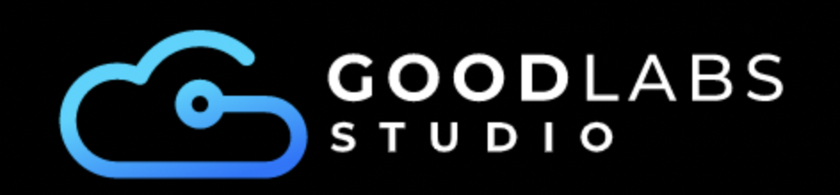

# GoodLabs Studio · Advanced KStreams Workshop Demos

> Practical Kafka Streams examples to accompany the Advanced KStreams Workshop by [GoodLabs Studio](https://goodlabs.studio)
> 

## Table of Contents

1. [Project Overview](#project-overview)
2. [Requirements](#requirements)
3. [Prerequisites](#prerequisites)
4. [Getting Started](#getting-started)
5. [Demos](#demos)
6. [Support](#support)

## Project Overview

This repository contains hands-on demos designed to reinforce concepts from GoodLabs Studio’s **Advanced KStreams Workshop**.
Each demo folder (Demo_1, Demo_2, etc.) illustrates a different Kafka Streams pattern—everything from RocksDB tuning to stream-joins and reconciliation logic.  

Use these demos to:
- Explore practical Kafka Streams scenarios, problems, and their solutions
- Experiment with configuration settings
- Observe and understand advanced metrics

## Requirements

- **Git ≥ 2.30.0**: `https://git-scm.com/downloads`  
- **Docker Engine ≥ 20.10.0** & **Docker Compose ≥ 1.29.0** (or **Docker Desktop**)  
- **Visual Studio Code** (or any IDE/editor of your choice)
- (Optional, for debugging) **Java 17 (JDK)** installed and on your `PATH`

## Prerequisites

This repository contains demos that are intended to supplement the Advanced KStreams Workshop provided by GoodLabs Studio.
To benefit fully from these demos, you'll need:
- A working knowledge of Java, or object-oriented languages with similar syntax.
- A basic understanding of containerization and multi-container applications.
- A good understanding of Kafka concepts such as topics, partitions, processing guarantees, and ordering.
- A good understanding of Kafka Streams concepts such as topologies, tasks, streams, tables, and operators.


## Getting Started

1. **Clone the repository**  
   ```bash
   git clone https://github.com/goodlabs-studio/kstreams-workshop-demos.git
   cd kstreams-workshop-demos
   ```
2. **Navigate to a demo folder**
    ```bash
    cd Demo_1
    ```
3. **Follow the instructions in the README.** Each demo has its own `README.md` with step-by-step instructions.

## Demos

| Demo | Topic | Description |
| --- | --- | --- |
| [Demo_1](./Demo_1/README.md) | Customizing RocksDB Configurations | Fine-tune state storage by tweaking RocksDB parameters. |
| [Demo_2](./Demo_2/README.md) | Adding Observability with JMX, Prometheus, and Grafana | Integrate JMX metrics exporters and view Grafana boards. |
| [Demo_3](./Demo_3/README.md) | Testing Join Types and Their Behaviors | Compare stream-stream, stream-table, table-table, and stream-global table joins. |
| [Demo_4](./Demo_4/README.md) | Reconciliation Using De-duplication Logic | Build a reconciliation pipeline to detect and handle duplicates. |

## Support

If you run into any issues, open an issue on GitHub: https://github.com/goodlabs-studio/advanced-kstreams-demos/issues
